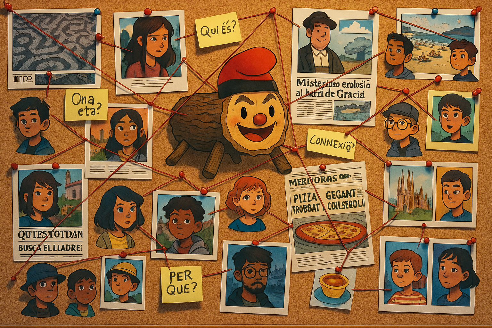

# Networks, Crowds and Markets - Fall 2025

<table>
<tr>
<td style="width:45%; vertical-align:top;">
  
</td>
<td style="width:55%; vertical-align:top; padding-left:15px;">
  This course offers an introduction to the mathematics of networks, their dynamics, and their applications in economics and the social sciences. We combine rigorous probabilistic models with real-world data and case studies, moving from the basics of Erdős–Rényi random graphs to power laws, small-world phenomena, clustering, and preferential attachment.
</td>
</tr>
</table>

***

### Announcements:
- For basic matrix algebra review check Section 1.4 and accompanying exercises [here](https://rksmvv.ac.in/wp-content/uploads/2021/04/Gilbert_Strang_Linear_Algebra_and_Its_Applicatio_230928_225121.pdf). I also recommend taking the course "Linear Algebra and Dynamical Systems".
- The midterm with answers can be found [here](./exams/midtermA_answers.pdf).
- In the bottom of the website you can see the dates for project presentations.
- Deadline for project submissions: November 18. Presentations start on November 19 and continue on November 24. 
- The proposed [project topics](./seminars/ProjectProposals.pdf) are released. To suggest your own topics contact me ASAP.
- The following [problem set](./seminars/Problem_set.pdf) contains exercises covering most of the course. We will use it for the seminars.
- **update:** The midterm is scheduled for Monday, November 3, during the lecture.
- I added the proof sketches for both theorems of Lecture 2. The slides have been updated. 
- The first lecture is on September 29, 3-4:30pm, in room 40.063. 

***

### Instructor:

| Prof |  [Piotr Zwiernik](https://pzwiernik.github.io/) |
| :--- | :--- |
| Email | piotr.zwiernik@upf.edu |
| Office hours | Tuesday 2-3pm (20.202) |

### Time & Location:

Lectures: Monday 3-4:30pm (40.063) and Tuesday 3-4:30pm (40.063).

Tutorials (group 1): 3-4:30pm (20.101)
Tutorials (group 2): 4:30-6pm (20.101)

There are six tutorial sessions, in weeks: 3,4,5,6,7,8. 

***

### Suggested Reading
The exam covers the material presented in the lecture and the accompanying slides as well as the problems discussed in the tutorial sessions. The following books complement what is presented in the lecture.

* (EK) Easley, Kleinberg (2010). Networks, Crowds, and Markets: Reasoning About a Highly Connected World. Cambridge University Press. [Available online](https://www.cs.cornell.edu/home/kleinber/networks-book/networks-book.pdf)
* (B) Barabási (2016). Network Science. Cambridge University Press. [Available online](https://networksciencebook.com/)
* (N) Newman (2010). Networks: An Introduction. Oxford University Press.
* (MFD) Menczer, Fortunato, David (2020). A First Course in Network Science. Cambridge University Press. [Available online](https://cambridgeuniversitypress.github.io/FirstCourseNetworkScience/)
* (SK) Saoub (2017). A Tour Through Graph Theory. Springer.

***

## Lectures and timeline (tentative)

| Week | Topic  | Slides | Tutorials | Colabs | Lectures date  | Timeline |
| --- |  --- | --- | --- | --- | --- | --- | 
| 1 | Motivation and first examples.   Special graphs, degree.  | [slides1](./slides/lecture1.pdf)    [slides2](./slides/lecture2.pdf)| - | [colab1](https://github.com/pzwiernik/22997-networks/blob/31f53e57e3c1bdad73fb6626f2a0ac5a1367d621/colabs/NetworkNotebook1.ipynb)| 29/30 Sept |  |
| 2 | Degree distribution, graph isomorphism, adjacency matrix.   Distance in graphs, diameter. Centrality measures.  | [slides3](./slides/lecture3.pdf)   [slides4](./slides/lecture4.pdf) | -| [colab2](https://github.com/pzwiernik/22997-networks/blob/638efb9e60f624a99d6c06b0f02df7c40147260b/colabs/NetworkNotebook2.ipynb)  [degree](https://github.com/pzwiernik/22997-networks/blob/31f53e57e3c1bdad73fb6626f2a0ac5a1367d621/colabs/Lecture3.ipyn)|  6/7 Oct | [report topics published](./seminars/ProjectProposals.pdf)|
| 3 | Centrality measures (continued),   Linear algebra, Random walks.| [slides5](./slides/lecture5.pdf)   [slides6](./slides/lecture6.pdf)| [sem1](./seminars/seminar1.pdf) | | 13/14 Oct |   |
| 4 |  Pagerank algorithm and HITS, Erdös–Rényi model  Degree distribution, threshold phenomena, clustering.   | [slides7](./slides/lecture7.pdf)   [slides8](./slides/lecture8.pdf)| [sem2](./seminars/seminar2.pdf) | [colab3](https://github.com/pzwiernik/22997-networks/blob/6c9d5dd4b074796553c22ed8c846c952e49b6914/colabs/NetworkNotebook3.ipynb)| 20/21 Oct |  |
| 5 | Clustering and small world   Power laws and hubs.  |[slides9](./slides/lecture9.pdf)   [slides10](./slides/lecture10.pdf) | [sem3](./seminars/seminar3.pdf)| | 27/28 Oct | |  |
| 6 | midterm   Static random graph models.  |  [extra](./slides/how_to_give_talks.pdf)   [slides12](./slides/lecture12.pdf)| [sem4](./seminars/seminar4.pdf)| | 3/4 Nov| midterm |
| 7 | Static random graph models.   Communities: definition and identification.  |[slides13](./slides/lecture13.pdf)   slides14| |[colab4](https://github.com/pzwiernik/22997-networks/blob/91d4ee96f970833dcbfa416e81682d42c17bb343/colabs/NetworkNotebook4.ipynb)  | 10/11 Nov | |
| 8 | Social networks, forming mechanism. Matching markets  | slides15   slides16| | | 17/18 Nov| deadline reports   presentations 1 |
| 9 | Matching markets   presentations  | slides17   slides18| - | | 24/25 Nov| presentations 2 |
| 10 | Spreading phenomena   Summary|slides19   slides20 | - | | 1/2 Dec| |

***

## NetworkX guidelines

Although coding is not an essential part of this course, it is a very important complementary part. As the absolute minimum, you should try to run the code provided in class. 

We use Python and NetworkX. Useful documentation and examples can be found on the [GitHub of MFD book](https://github.com/CambridgeUniversityPress/FirstCourseNetworkScience/tree/master).

I suggest to start like that:
- Create a [Google Colab](https://colab.research.google.com/) account (you should be able to do it using your UPF account).
- Take a look at [MFD:Appendix A](https://github.com/CambridgeUniversityPress/FirstCourseNetworkScience/blob/de9b42e3953ed90616940a801f64489067c1b888/tutorials/Appendix%20-%20Python%20Tutorial.ipynb). No need to read it completely. Use it as a reference.
- Start with the [first colab](https://colab.research.google.com/drive/16r0vZQRAynCS0hAHtJxrkX0MHR6gK8Zp?usp=sharing).

***

## Report presentations (15min+ques): 

Group letters refer to the grouping from Aula Global.

101 (19 Nov)
1. Group P: Friendship paradox
2. Group B: Misinformation and Influence Dynamics on Social Media
3. Group N: Cascading Failures and Systemic Risk
4. Group H: Structural Balance of Social Networks
5. Group G: Learning in Networks: Diffusion of Information 

102 (19 Nov)
1. Group C: Friendship paradox
2. Group K: Misinformation and Influence Dynamics on Social Media
3. Group F: Cascading Failures and Systemic Risk
4. Group M: Structural Balance of social network 

Lecture (25 Nov)
1. Group D: Voting 
2. Group I: Percolation and Network Resilience 
3. Group E: Credit default prediction
4. Group J: Kidney Exchange Project
  
